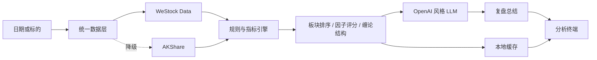
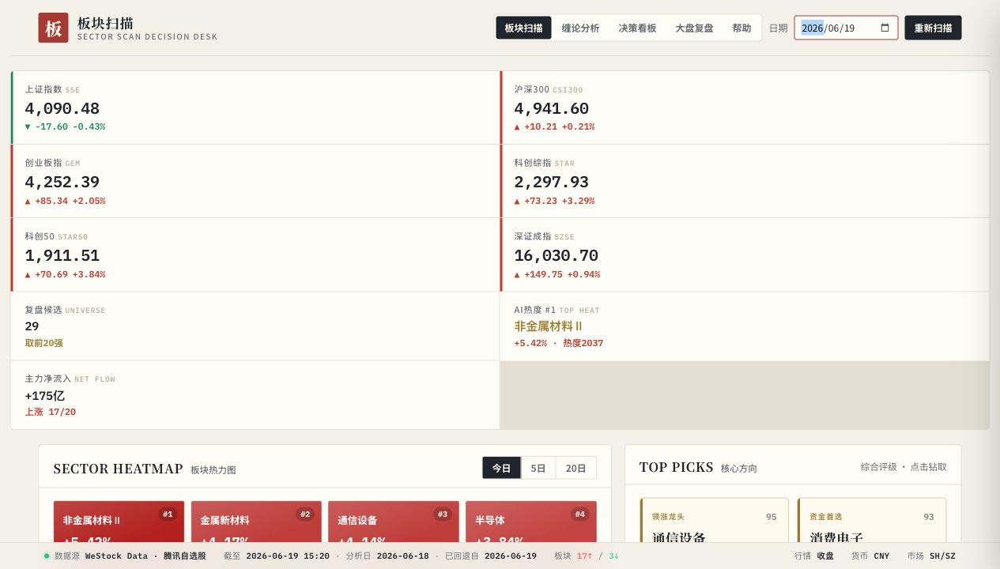
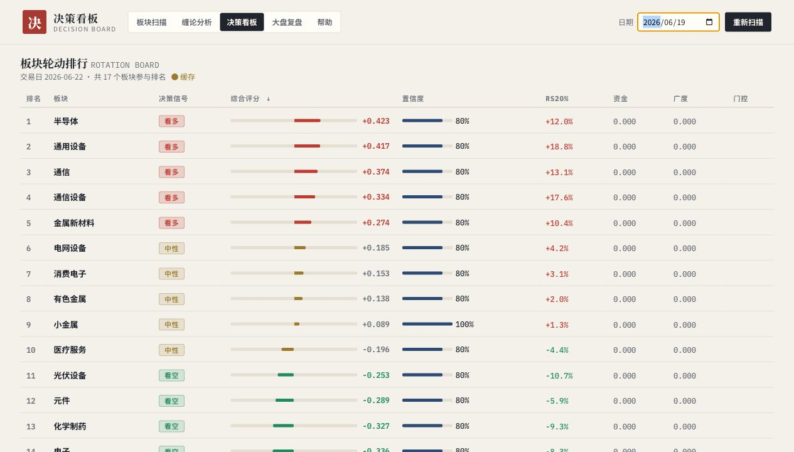
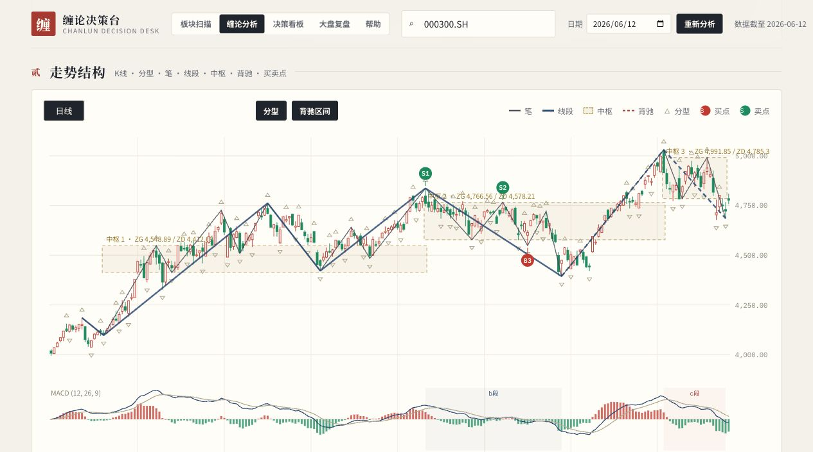
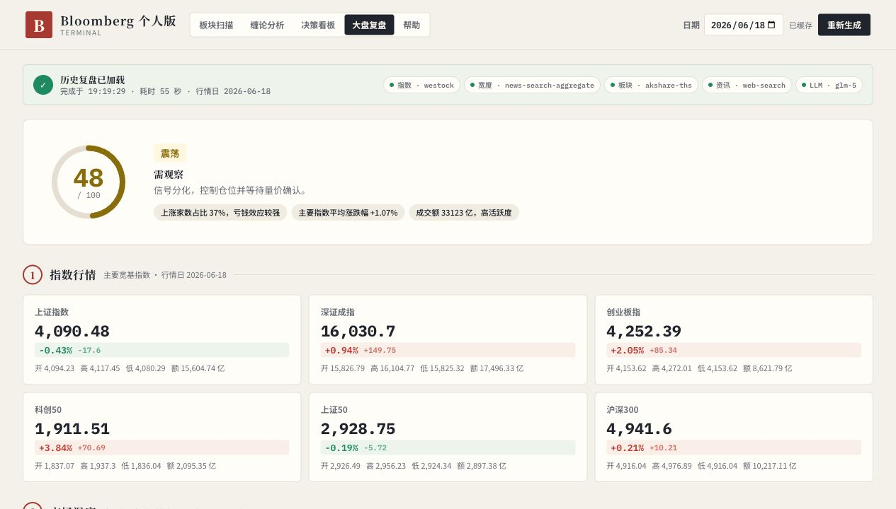

# 把市场噪音压成一张雷达：我做了一个本地 A 股 AI 终端

做这个项目的起点很简单：A 股从来不缺数据，缺的是一套能把数据整理成结论的工具。每天收盘后，指数、板块、资金和消息混在一起，个人投资者很难快速判断：市场主线在哪里，强势能否延续，重点标的处于什么结构位置？

我决定做一套本地运行的分析终端，把复盘路径收敛为四步：**看大盘、找板块、做量化比较、下钻结构**。它不预测涨停，也不替用户交易，只提供可核验的事实、信号和复盘摘要。

## 从原型到可用系统

前端原型已经具备较完整的信息结构，因此我没有重做界面，而是围绕它补齐真实数据和后端能力。整体技术栈保持克制：原生前端配合 Python 标准库 `ThreadingHTTPServer`，一个服务同时承载页面、API、缓存和模型调用，不引入 Flask、FastAPI 或 Node 后端。

架构上，我把“计算”和“表达”明确分开：行情涨跌、板块排序、资金、技术指标、多因子评分和缠论结构全部由规则引擎计算；AI 只读取压缩后的事实快照，负责总结和解释。即使模型未配置或调用失败，系统仍能返回完整的规则分析。

## 四个模块，一条复盘链路

**板块扫描**以标准行业板块为候选池，优先使用 WeStock Data，AKShare 作为备用。系统按指定日期复盘全量候选，输出涨幅前 20 强；热力图、趋势图、资金流和列表共享同一份排序结果，切换日期会同步更新。资金流覆盖 1 日、5 日和 20 日，历史结果按日期保存在本地。

**多因子决策看板**为 36 个主要行业维护 ETF 行情代理，从趋势、动量、资金和广度等维度计算截面评分，并映射为五档信号。用户可以从行业排名继续下钻到因子明细、成分股和 ATR 价格观察区间。

**缠论分析**支持 A 股、港股和指数。后端依次完成 K 线包含处理、分型、笔、线段、中枢、MACD、背驰和一二三类买卖点识别。图中的每个信号都来自规则计算，并保留结构依据。沪深 300 示例使用 220 根真实日 K，识别出 1 个买点和 2 个卖点。

**大盘复盘**汇总主要指数、市场宽度、行业强弱和盘后资讯，再由模型生成结构化报告。页面同时显示每项数据的来源、降级状态和模型状态，让结论能够回到数据本身。

## 具体成果

当前系统已经形成 4 个分析模块、5 个统一导航页面和一套共享后端。一次真实样本中，板块扫描复盘 29 个行业候选并呈现 Top 20；大盘复盘汇总 6 个宽基指数、全市场涨跌家数、90 个行业指数和盘后资讯，首次生成约 55 秒，同日结果之后可直接从缓存打开。

更重要的是，系统形成了几条稳定的设计原则：数据口径优先于模型能力；规则负责事实，AI 负责表达；所有分析都要支持降级、缓存和来源追踪。模型接口兼容 OpenAI 风格配置，可以灵活替换，但不会改变底层指标。

下一步会补充历史回测、信号统计、可配置因子权重和板块跨日期迁移视图。AI 仍然只做总结与复盘，不提供投资建议。我希望它最终成为一张安静、透明、真正适合个人投资者使用的市场雷达。
